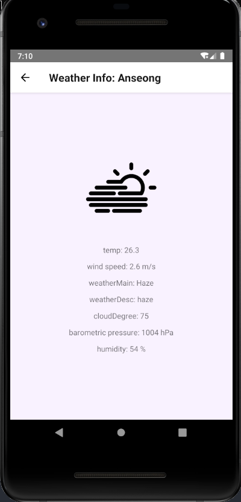

# React native - whether-crawler-app

### 충남대학교 실전코딩 6조

<hr/>

1. 기본적인 UI 재구성

   

   위 처럼 상단바/하단메뉴바를 만들었으며 아래 navigation탭이 있어서 해당 탭을 터치/클릭 하면 해당 화면으로 넘어가게 됩니다. 위의 화면은 Home에 해당하는 화면이며,  초기 지정 되어있는 지역의 현재 날씨에 대한 세부 정보가 홈에 나타나게 됩니다. 또한 가져온 날씨에 해당하는 사진을 홈 화면에 표시해, 사용자가 날씨를 쉽게 알아볼 수 있도록 하였습니다.

   (디자인은 (react-native-paper, https://reactnativepaper.com/ ) 를 사용해 구성하였습니다.)

    ```{
     render() {
       return (
         <View style={styles.container}>
           <FixedTopBar title="현재 날씨"></FixedTopBar>
           <BottomFixedNavigation stackNavigation={this.props.navigation}/>
         </View>
       )
     }
   }
    ```

   첫페이지의 index.js의 render코드 입니다.

   FixedTopBar와 BottomFixedNavagation을 렌더링 하고 있으며, BottomFixedNavagation이 메인 화면을 렌더링 하게 됩니다.

   BottomFixedNavagation이 처음으로 렌더링 하는 것은 HomeScreen, 즉 홈 화면입니다.

   <hr/>

2. 리스트 목록 및 해당 리스트 날씨보기

   

각 리스트 항목마다 Label Icon을 붙여 보기 좋게 구성하였습니다.

```
    return (
      <View>
        <ScrollView>
          <FlatList style={styles.container}
                    renderItem={({ item }) => this.renderItem(item)}
                    keyExtractor={item => item}
                    data={this.state.cities}
          />
        </ScrollView>
      </View>
    );
  }
}
```

리스트를 보여주는 index.js의 render함수 부분입니다. FlatList와 Scrollview를 이용하였습니다.

리스트에서 원하는 도시의 이름를 터치/클릭을 하게 되면



이런식으로 화면에 날씨를 볼 수 있게 됩니다. 기존에 날씨만 단순히 표기가 되었더라면 세부 날씨 정보를 표시해주고, 날씨에 맞게 아이콘이 뜨도록 구성하였습니다. 리스트 항목이 클릭되면 bottomFixedNavigation에서 weatherDetailScreen으로 stackNavigation을 사용해 이동하게 되며, 뒤로가기 버튼을 클릭하게 되면 다시 bottomFixedNavigation를 사용해 렌더링하는 화면으로 돌아가게 됩니다. 

```  
  onPressCity(item) {
    this.props.navigation.navigate(
      'Detail',
      {
        city: item
      }
    );
  }

  renderItem(city) {
    return (
      <TouchableOpacity style={styles.item} onPress={() => 					this.onPressCity(city)}>
        <Button icon={{source : "label", direction: 'ltr'}} raised theme={{ roundness: 3 }}>{city}</Button>
      </TouchableOpacity>
    );
  }
```

리스트가 클릭이 되었을의 이벤트를 처리하는 onPress 함수 부분 코드입니다.

```  
render() {
    if (this.state.isLoading) {
      return (
        <ActivityIndicator style={styles.ActivityIndicatorStyle} animating={true} color={Colors.blue200} />
      )
    }

    let celsius = this.state.main.temp - 273.15;
    let weatherMain = this.state.weather[0].main;
    let weatherDesc = this.state.weather[0].description;
    let windSpeed = this.state.wind.speed;
    let cloudDegree = this.state.clouds.all;
    let pressure = this.state.main.pressure;
    let humidity = this.state.main.humidity;

    let weatherImage;

    switch (weatherMain) {
     case 'Clouds':
       weatherImage = require(CloudyImage);
       break;
     case 'Haze':
       weatherImage = require(HazeImage);
       break;
     case 'Clear':
       weatherImage = require(ClearImage);
       break;
     case "Rain":
       weatherImage = require(RainyImage);
       break;
     case "Fog":
       weatherImage = require(FogImage);
       break;
     case "Snow":
       weatherImage = require(SnowImage);
       break;
     case "Mist":
       weatherImage = require(MistImage);
     default:
       weatherImage = require(ClearImage);
       break;
     }

    return (
      <View style={styles.container}>
        <Image style={styles.ImageStyle} source={weatherImage} />
        <Text style={styles.TextStyle}>temp: {celsius.toFixed(1)}</Text>
        <Text style={styles.TextStyle}>wind speed: {windSpeed} m/s</Text>
        <Text style={styles.TextStyle}>weatherMain: {weatherMain}</Text>
        <Text style={styles.TextStyle}>weatherDesc: {weatherDesc}</Text>
        <Text style={styles.TextStyle}>cloudDegree: {cloudDegree}</Text>
        <Text style={styles.TextStyle}>barometric pressure: {pressure} hPa</Text>
        <Text style={styles.TextStyle}>humidity: {humidity} %</Text>
      </View>
    );
  }
}
```

화면에 날씨정보를 뿌려주는 .js의 render 부분입니다.

<hr/>

3.추가구현기능 (bookmark)


북마크리스트가 있고 등록을 해놓으면 사용자가 북마크리스트에서 해당 도시이름을 클릭/터치 하면 해당 도시의 날씨가 보이게 됩니다.

아쉽게도 구현은 코드단계에서 북마크를 지정해주어야 사용이가능합니다.

목표는 리스트목록에서, 또는 상세날씨 페이지에서 체크박스나 버튼을 눌러서 북마크를 지정해서 서버에 저장한 뒤 북마크 탭에서 서버에 저장된 파일을 읽어서 리스트로 만드려고 했으나 react-native-fs를 이용한 readFile, writeFile이 잘 되지 않았고 구글에 검색을 해봐도 해결을 할 수 없어서 완벽하게 구현하지 못하였습니다.

(파일 읽기 쓰기에 대한 문제는 경로를 컴퓨터의 로컬폴더로 하는 방법, 안드로이드 가상머신의 폴더의 경로로하는 방법 다 찾아서 해보았는데도 계속 문제가 생겼습니다.)

<hr/>

4. UX 추가 설명


로딩이 발생했을 때 위의 사진에 해당하는 로딩화면이 뜨도록 수정을 했습니다.

<hr/>


날씨 세부 사항에 대한 정보를 표기할 때 쓰는 아이콘들입니다.

<hr/>


Home화면에서의 날씨를 표기할 때 쓰는 사진들입니다.
