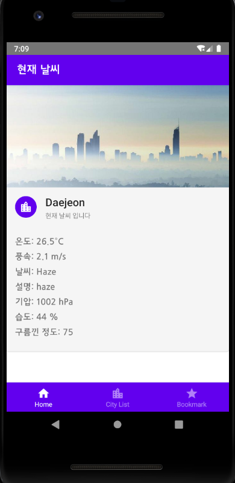
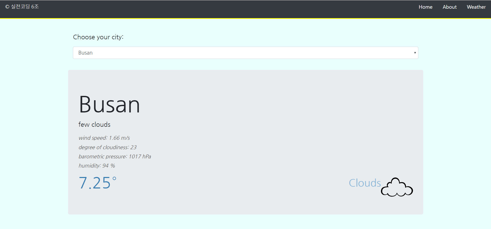

<h2>Weatherforecaster-Web-Application</h2>
2019 CNU Practical Coding Homework

실전코딩 수업 때 진행했던 리액트, 리액트 네이티브 연습 코드이다. 

<h2>Development Environment</h2>

```
HW01 : Bootstrap 4.3.1, React, Spring  
HW02 : React Native, React-Native-Paper, Spring
```

<h2>Screen shot</h2>

<p align="center">
        
</p>


<p align="center">
       
</p>

자세한 것은 각 폴더 내 README 참조


<h2>Manual</h2>
각 프로젝트 폴더 내 README 참조
